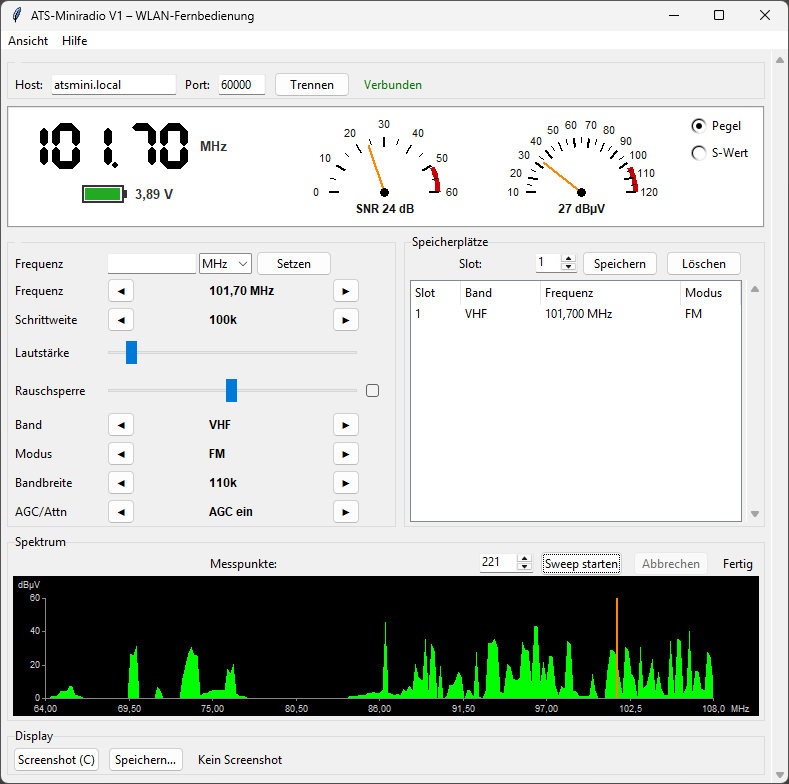

# ATS-Mini WLAN-Fernbedienung

Desktop-Fernbedienung für das **ATS-Miniradio V1** (ESP32-S3 + SI4732) über WLAN.
Die Anwendung verbindet sich mit dem integrierten TCP-Fernsteuerport der
Firmware (Ad-hoc-Protokoll, Port 60000) – am Radio muss nichts umgebaut werden.

Geschrieben in Python, nur Standardbibliothek (Tkinter für die Oberfläche) –
keine Zusatzpakete nötig.



## Voraussetzungen

* Python 3.10 oder neuer (mit Tkinter; unter Debian/Ubuntu: `python3-tk`)
* ATS-Miniradio mit der Community-Firmware
  [esp32-si4732/ats-mini](https://github.com/esp32-si4732/ats-mini)
  (funktioniert für V1; die offizielle chinesische Firmware unterstützt das
  TCP-Protokoll ebenfalls ab den neueren Versionen)

## Am Radio einstellen

1. `Settings → Wi-Fi` → `AP Only`, `AP+Connect` oder `Connect` (Details siehe Anleitung zur Radio-Firmware)
2. `Settings → TCP Port` → `Ad hoc`

## Anwendung starten

### Windows ohne Installation (empfohlen)

Das neueste Release auf der
[Release-Seite](https://github.com/michaelgroni/ats60000/releases)
herunterladen: Die EXE-Datei, z. B. `ATS-Mini-Remote-0.3.exe`, ist direkt ausführbar.

Eine ausführliche Schritt-für-Schritt-Anleitung für Windows-Benutzer gibt es auf Deutsch in
[docs/ANLEITUNG.md](docs/ANLEITUNG.md) und auf Englisch in
[docs/GUIDE.md](docs/GUIDE.md).

* Beim ersten Start zeigt Windows SmartScreen eine Warnung („Windows hat
  Ihren PC geschützt“), weil die EXE nicht digital signiert ist.
  *Trotzdem ausführen* wählen.
* Wer Python bereits installiert hat: kein Konflikt, die EXE bringt
  ihren eigenen Interpreter mit und berührt keine bestehende
  Python-Installation.

### Mit Python

```shell
python3 -m ats_mini_remote
```

Dann Host und Port anpsseen (in der Regel nicht nötig) und auf
**Verbinden** klicken. Beim Programmstart wird automatisch einmal
versucht, das Radio unter dem eingetragenen Host zu erreichen – schlägt
das fehl, verbinden einfach von Hand.

Die Oberfläche lässt sich in der Menüleiste unter *Ansicht → Sprache*
zwischen Deutsch und Englisch umschalten.

### Bedienung

* **Frequenz**: Direkteingabe (z. B. `107.9` MHz) oder schrittweise mit
  `◀`/`▶`.
* **Schrittweite / Lautstärke / Band / Modus / Bandbreite / AGC/Attn**:
  je eine Zeile mit `◀`/`▶`-Buttons, der aktuelle Wert steht dazwischen.
  Die Lautstärke (0–63) wird als Schieberegler erst beim Loslassen
  gesendet – Ziehen am Regler erzeugt keinen Befehlsburst.
* **S-Meter**: Analoge Zeigerinstrument-Anzeige rechts der Steuerleiste,
  umschaltbar per Radiobutton zwischen Pegel (dBµV), S-Wert
  (S1 … S9 mit Bereich +10 … +60 dB darüber) und SNR (dB). Der obere
  Skalenbereich ist rot markiert; die Wertziffer färbt sich dort rot.
* **Rauschsperre** (nur AM/FM): Blendet Rauschen unterhalb der
  eingestellten Empfindlichkeit aus, basierend auf RSSI und SNR mit
  Hysterese. Da das Radio keine Stummschaltung kennt, wird die Lautstärke
  dazu vorübergehend auf 0 gesetzt und beim Öffnen der Sperre
  zurückgestellt. In SSB-Modi sind Regler und Checkbox ausgegraut.
* **Spektrum**: Manueller Band-Sweep auf Knopfdruck. Die Zahl der
  Messpunkte wird abhängig von der Bandbreite des eingestellten Bands
  empfohlen (z. B. mehr Punkte im VHF-Band), lässt sich aber frei
  einstellen. Das Programm wählt passend dazu die feinmögliche
  Schrittweite und eine Bandbreite nach Punktabstand, vermisst das Band
  und interpoliert die Fläche lückenlos (grün). Zurückschauen in der
  Zeit: ein blasseres Polygon zeigt den Verlauf aus vorherigem Wert und
  gleitendem Mittelwert (Peak-Hold je Frequenz). Ein Klick ins Spektrum
  stimmt die Frequenz an der Stelle an (auf dem Schrittweiten-Raster) –
  auch ohne vorherigen Sweep; der Bereich ergibt sich dann aus dem
  aktuellen Band.
* **Speicherplätze**: Tabelle mit den belegten Slots, stets sichtbar
  neben der Steuerung; Anzeigen (`$`), aktuellen Sender in einen Slot
  schreiben (`#`), Slot löschen (Frequenz 0). Das Aufrufen eines Slots
  erfolgt am Radio selbst – dafür gibt es im Protokoll keinen Befehl.
* **Screenshot**: Fängt das Radio-Display ab (BMP) und zeigt es an;
  speicherbar als Datei.
* **Log**: Rohdaten der Verbindung im unteren Bereich, als Tabelle mit
  Spalten (Zeit, Quelle, Nachricht); über *Ansicht* ein- und ausblendbar,
  beim Start ausgeblendet.

## PWA für Smartphone und Tablet (Bluetooth)

Im Ordner [web/](web/) liegt eine Progressive Web App, die das Radio per
**Bluetooth LE** statt WLAN steuert – ohne Zusatzhardware. Sie nutzt dasselbe
Ad-hoc-Protokoll wie die Desktop-Fernbedienung, nur als Transport über den
Nordic UART Service der Firmware.

Am Radio einmalig einstellen: `Settings → Bluetooth → Ad hoc`.

| Plattform | Browser |
|---|---|
| Android | Chrome, Edge (Web Bluetooth direkt) |
| iPhone/iPad | [Bluefy](https://apps.apple.com/us/app/bluefy-web-ble-browser/id1492822055) (Web-Bluetooth-Browser) |
| Desktop | Chrome, Edge (mit Bluetooth-Adapter) |

Die App muss über HTTPS ausgeliefert werden, z. B. über GitHub Pages. Ohne
passenden Browser meldet sie einen klaren Hinweis. Enthalten: Verbinden mit
automatischem Monitor-Start, Siebensegment-Frequenzanzeige mit festem
Dezimalpunkt, S-Wert/RSSI/SNR, Frequenz- und Rastersteuerung, Lautstärke per
Burst, Log. Beim Abbruch der Verbindung verbindet sie automatisch nach.

Tests der Web-Portierung (Node 18+):

```shell
node --test web/tests/protocol.test.mjs web/tests/ble.test.mjs
```

## Ohne Radio testen (Mock-Server)

Zum Ausprobieren der Oberfläche ohne Empfangsgerät liegt ein
Protokollnachbau des Radios bei:

```shell
python3 -m ats_mini_remote.mock_receiver
```

Danach in der Anwendung `localhost` als Host verwenden. Der Mock bedient
Bänder (LW/MW/SW/80m/VHF), Modi (FM/AM/LSB/USB), Frequenz-, Lautstärke- und
Speicherbefehle und erzeugt Screenshots.

## Tests

```shell
python3 -m unittest discover -s tests -v
```

## EXE selbst bauen (Windows)

Die Windows-EXE des Releases wird mit PyInstaller erzeugt – die
Konfiguration liegt in `ats-mini-remote.spec`:

```shell
pip install pyinstaller
pyinstaller ats-mini-remote.spec
```

Ergebnis: `dist\ATS-Mini-Remote.exe` (im Release wird die Datei in
`ATS-Mini-Remote-<Version>.exe` umbenannt). Alternativ baut der
GitHub-Workflow (`.github/workflows/release.yml`) die EXE automatisch
und veröffentlicht sie als Release, wenn ein Versions-Tag (`v…`)
gepusht wird:

```shell
git tag v0.1
git push origin v0.1
```

## Projektstruktur

```
ats_mini_remote/
├── __init__.py
├── __main__.py        # Einstieg: python3 -m ats_mini_remote
├── app.py             # Tkinter-Oberfläche, Spektrum, S-Meter
├── client.py          # TCP-Client mit Lese-Thread und Send-Guard
├── i18n.py            # Oberflächentexte Deutsch/Englisch
├── mock_receiver.py   # Nachbau des Radio-Fernsteuerprotokolls (Demo/Test)
└── protocol.py        # Ad-hoc-Protokoll: Befehle, Status, Sweep-Planung,
                      # S-Wert-Tabelle, Locale-Zahlenformate
web/                   # PWA: Bluetooth-Fernbedienung fürs Smartphone
├── index.html, app.js, style.css
├── ble.js             # Web-Bluetooth-Transport (Nordic UART Service)
├── protocol.js        # Protokoll-Portierung (wie protocol.py)
└── tests/             # Node-Tests der Web-Portierung
tests/                 # Unit- und Integrationstests
```

## Lizenz

[MIT](LICENSE) – Verwendung, Änderung und Weitergabe sind frei,
solange der Copyright-Hinweis erhalten bleibt.

## Hinweise

* Die TCP-Steuerung ist unverschlüsselt und ohne Anmeldung – wie in der
  Firmware-Dokumentation beschrieben nur in vertrauenswürdigen Netzen
  verwenden.
* Detailbeschreibung des Protokolls:
  [Remote control (ats-mini docs)](https://esp32-si4732.github.io/ats-mini/remote.html)
